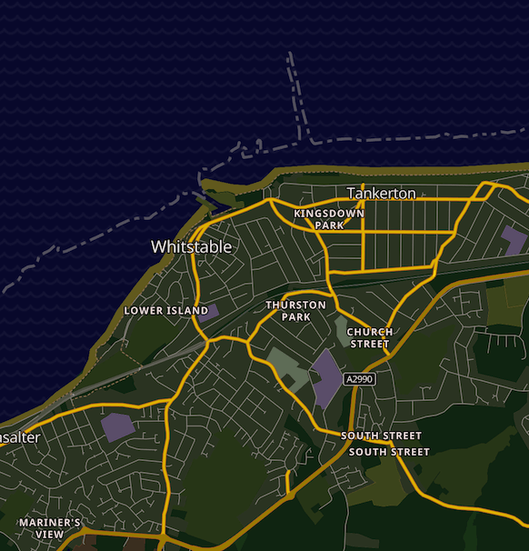

# OSM Dark

A GL JS basemap style showcasing OpenStreetMap. It is using the vector tile schema of [OpenMapTiles](https://github.com/openmaptiles/openmaptiles).

Based on the ubiquitous OSM Bright style.

Recoloured by Graham Parks for use in Dark Mode, with emphasis on high contrast roads for navigation.

